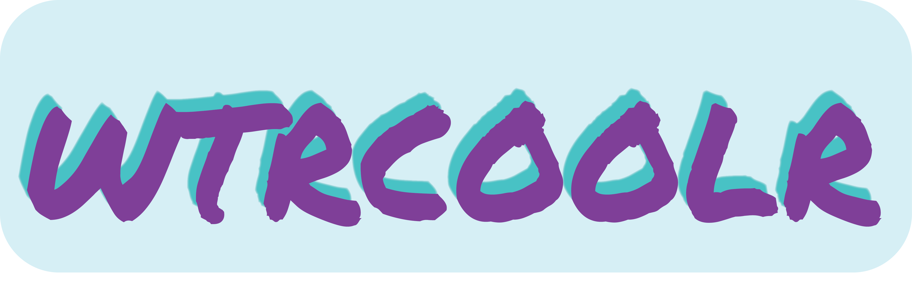

`wtrcooler` is the best MERN Stack video chatting app to help remote teams build bonds and socialize.

## Live Link:

[wtrcooler live](https://wtrcoolr.herokuapp.com/#/)

## Our Tech Stack:

`wtrcoolr` is a MERN stack app, meaning it is fully javascript from stem to stern. The rundown goes like this:

 - Backend:
   - Server: built on the Express framework and running on Node.js
   - Database: No-SQL MongoDB
 - Frontend:
   - React-Redux to provide SPA or single page app functionality
 - Integration:
   - API endpoints to pass data between Express server and React-Redux frontend.

## Feature Spotlight:

### 2 - Coolr Chat

Coolr chat uses Socket.IO and SimplePeer to implement web socket communication between two coworkers.

To begin the chat or 'coolr', two peers are matched and their websocket id's syncronized. This process begins on connection. Each user is assigned a socket id which is then sent to the database: 

<br></br>
``` 
<!-- ./frontend/src/components/coolr_video/coolr_video -->
const { user } = this.props
    this.socket.on('connect', data => {
      this.setState({ sendSocket: this.socket.id })
      if( this.socket.id ) {
        this.props.assignSocket({ user: user, sendSocket: this.socket.id })
        this.props.fetchSocket(socketToFetch);
      }
    })
```
<br></br>

Immediately after their socket id's are sent to the database, each user searches the database for their match through a purpose-built API route which returns a 400 error if the user being queried does not have a socket id assigned. Email is used for the query, as it has a uniqueness database constraint, however, user id would also be sufficient.

<br></br>

```
<!-- ./frontend/src/actions/users_actions -->
export const fetchSocket = email => dispatch => {
  return APIUsersUtil.fetchSocket(email)
    .then(user => dispatch(receiveUserSocket(user)))
    .catch(err => console.log(err))
}

<!-- ./routes/api/users -->
router.get('/sockets/:email', (req, res) => {
  const email = req.params.email
  User.findOne({ email: email })
    .then(user => {
      const payload = { user: user.id, name: user.name, socket: user.socket, email: user.email }
      if( user.socket ) {
        res.status(200).json(payload)
      } else {
        res.status(400).json({error: 'User has no assigned socket'})
      }
    })
}) 
```
<br></br>

Once each user has their peer, a syncronization process is started. This process is so ensure that both users have the correct socket id's and user information. On a high level, users receive their peer and broadcast a 'handshake' to their peer's socket id. When each user receives a 'handshake' it checks the senders socket id against the socket id the user retreived from the server, reassigning the socket id if necessary. Once the reassignment is done, each user sends a 'synced' message to the other and communications can begin.

```
<!-- ./frontend/src/components/coolr_video/coolr_video -->
    this.socket.on('handshake', data => {
      this.setState( { receiveSocket: data.sendSocket } )
      this.socket.emit('sync', {
        to: this.state.receiveSocket,
        from: this.socket.id
      })
    })

    this.socket.on('sync', data => {
      this.setState({
        synced: true,
        receiveSocket: data.from
      })
    })

```

Once syncronized, users can chat with one another. As each user types a message, the message is saved to local state. 

```
<!-- ./frontend/src/components/coolr_video/coolr_video -->
handleChatChange = (e) => {
    this.setState({
      chatMessage: e.currentTarget.value,
    });
  };
```

Users can then press enter to submit a message as well as clicking the send button, this is acheived through a function that looks for the `enter` key through the React `onKeyPress` prop callback.

```
<!-- ./frontend/src/components/coolr_video/coolr_video -->
 handleKeyPress = (e) => {
    if (e.charCode === 13) {
      this.submitChatMessage(e);
    }
  };
```

When the above function is triggered it calls the submit chat message callback. The message object is then constructed and the message is sent through an emit call. The message is then picked up by the server and routed to the intended recipient. 

```
<!-- ./frontend/src/components/coolr_video/coolr_video -->
submitChatMessage = (e) => {
    const { 
      chatMessage, 
      receiveSocket, 
      sendSocket } = this.state
    if (chatMessage === "") {
      return null;
    }

    const { user } = this.props;
    const { userId, name } = user;
    const time = moment();
    e.preventDefault();
    const message = {
      sendSocket: sendSocket,
      receiveSocket: receiveSocket,
      chatMessage,
      userId,
      name,
      time,
    }
    this.socket.emit("sendChatMessage", message);
    this.setState({ messages: this.state.messages.concat(message) })
    this.setState({ chatMessage: "" });
    this.scrollToBottom();
  };
```

The server routing function:

```
<!-- ./app -->
socket.on('sendChatMessage', msg => {
    console.log(`New Chat Message from ${msg.name} at socket: ${msg.sendSocket} to socket: ${msg.receiveSocket}`)
    console.log(msg)
    return io.to(msg.receiveSocket).emit('receiveChatMessage', msg)
  })
```

When each user receives a message, the message is added to local state and the senders socket id is again checked against the stored value. A chat notification sound is also played.

```
<!-- ./frontend/src/components/coolr_video/coolr_video -->
this.socket.on("receiveChatMessage", (message) => {
      this.setState({ messages: this.state.messages.concat(message) });
      if( this.props.userMatch.socket !== message.sendSocket ) {
        this.setState({ receiveSocket: message.sendSocket })
      }
      this.chatNotificationSound().play();
      this.scrollToBottom();
    });
```

The messages are rendered through a simple mapping function:

```
<!-- ./frontend/src/components/coolr_video/coolr_video -->
renderMessages() {
    if (!this.state.messages.length) return null;
    const messages = this.state.messages.map((message) => {
      return (
        <li key={uuidv4()} className="message">
          <b>{message.name}</b>
          <span>{message.chatMessage}</span>
        </li>
      );
    });
    return <ul className="chat-message-list">{messages}</ul>;
  }
```

A scroll to bottom function is called as a callback in both the receive chat message and send chat message functions so that the user doesnt have to continually scroll down to read the most recent message.

```
<!-- ./frontend/src/components/coolr_video/coolr_video -->
  scrollToBottom = () => {
    this.messagesEnd.scrollIntoView({ behavior: "smooth" });
  };
```

<!-- Video chat function coming soon -->